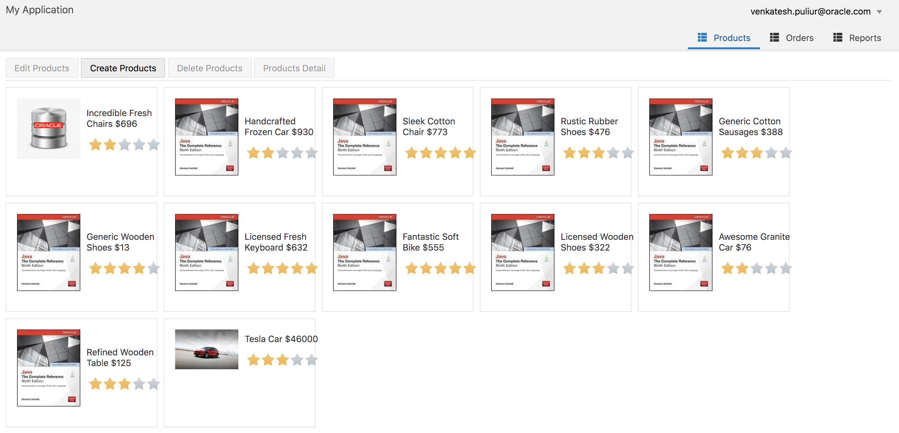
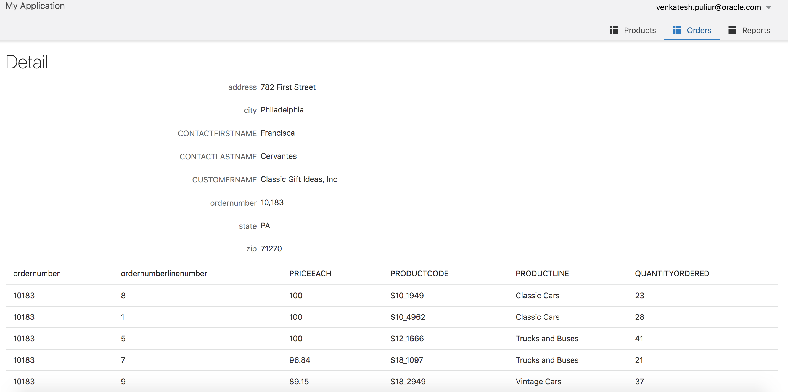
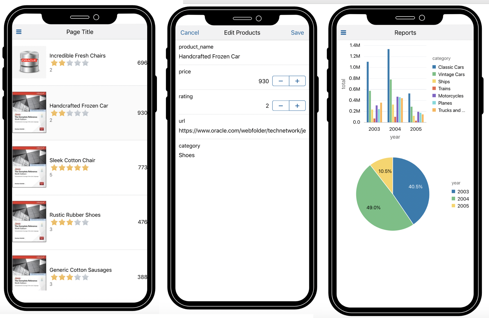

# Open World 2019 - Oracle Visual Builder Hands-on Lab - BYOL [HOL2752]
### PLEASE NOTE: YOU MUST BRING YOUR OWN LAPTOP (BYOL) TO PARTICIPATE IN THIS HANDS-ON LAB.
In this hands-on lab, experience productive visual development with a REST/HTML/JavaScript stack. Leverage Oracle Visual Builder to create mobile and web apps that leverage the cutting-edge UI capabilities of Oracle JavaScript Extension Toolkit (Oracle JET). Also see how to simplify development with a visual approach that drastically reduces the mundane coding of building JavaScript apps.

### SPEAKERS
* **Michael Ferrante**, Principal Product Manager, Oracle
* **Sherry Yu**, Senior Principal Product Manager, Oracle 
* **Venkatesh Rangarajan Puliur**, Senior Principal Product Manager, Oracle

### CodeOne Details
* Code One Tracks: Cloud Native, Developer Tools, Modern Web
* Session Type: HOL (Hands-on Lab) Session
* Tuesday, September 17, 12:30 PM - 02:30 PM

### CODEONE Link
[https://events.rainfocus.com/widget/oracle/oow19/catalogcodeone19?search=HOL2752](https://events.rainfocus.com/widget/oracle/oow19/catalogcodeone19?search=HOL2752)

### Visual Builder trial signup

We will be using trial account for this hands on lab. You can signup for a trial account for Visual Builder by following the instructions [here](https://venkspr.github.io/vbsignup/).

**Important** : Please use the email account you used to register for Oracle OpenWorld/CodeOne to be eligible for a free trial account and trial credits.

### Labs
* [Lab1](lab1) - **Basic Setup, BO Import & List Page based on BO**
* [Lab2](lab2) - **Service Connection & Views based on those**
* [Lab3](lab3) - **Visualization Basics**
* [Lab4](lab4) - **Mobile App**

### Application we are building

### Mobile App

