## Lab 2 : BYOL [HOL2752]
* TOC
{:toc}

# Introduction

The focus of this lab session is connecting to third party rest service and building features on top of those. This is a continuation of [lab 1 exercise](lab1). If you have not completed Lab 1, please click on this link and complete [lab 1](lab1).

The first screen we are going to build in this session is to display a list of orders from a third party rest endpoint. Next we will build a details page, that will list order details.

The rest endpoints used in this exercise are

1. Order List : [https://apex.oracle.com/pls/apex/venks/om/orders](https://apex.oracle.com/pls/apex/venks/om/orders)
2. Order Header :[https://apex.oracle.com/pls/apex/venks/om/order/10145](https://apex.oracle.com/pls/apex/venks/om/order/10145)
3. Order Lines : [https://apex.oracle.com/pls/apex/venks/om/orders/10145](https://apex.oracle.com/pls/apex/venks/om/orders/10145)

# Create order listing from third party rest endpoint

## Step 1 : Click on Service Connection

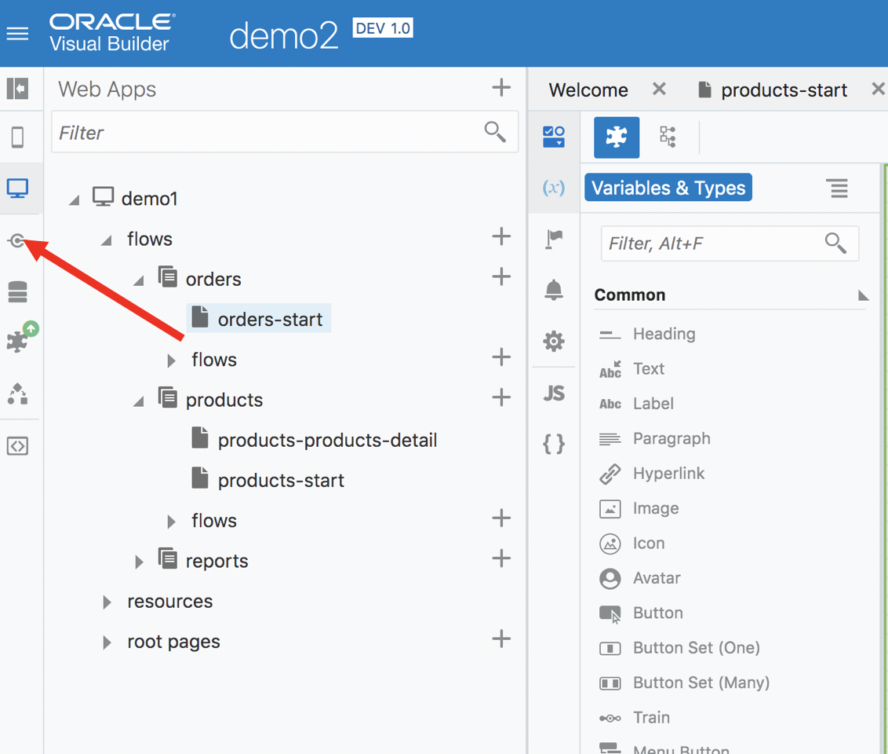

## Step 2: Click on +Service Connection


## Step 3: Choose Define by endpoint

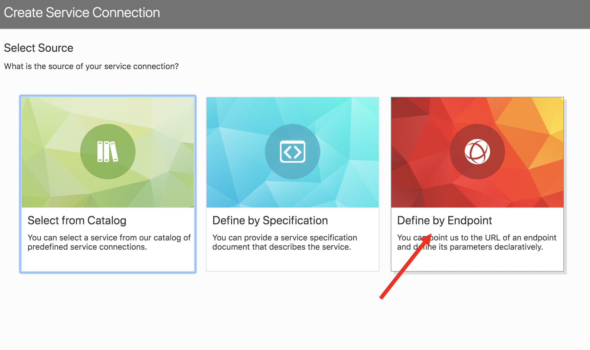

## Step 4: Copy paste the following URL in the text box to connect to a third party endpoint.

https://apex.oracle.com/pls/apex/venks/om/orders

Since we are going to retrieve a collection of orders, ensure that Get Many is chosen.

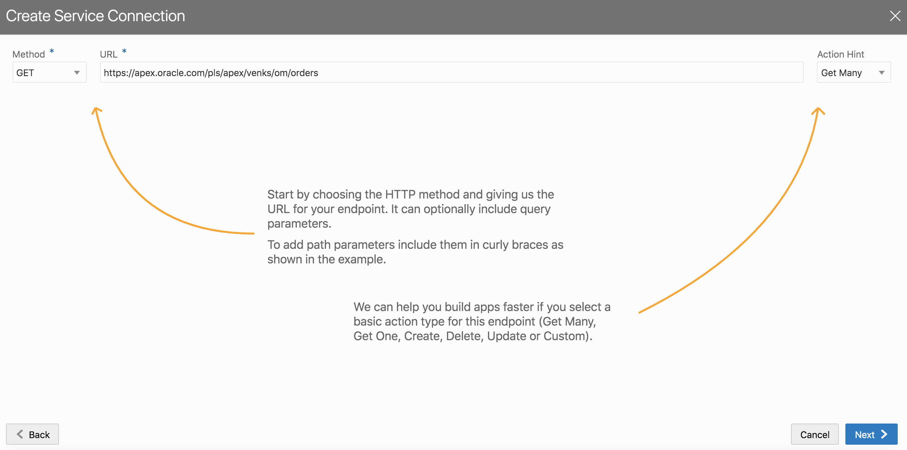

## Step 5: Give a suitable name (getOrders)

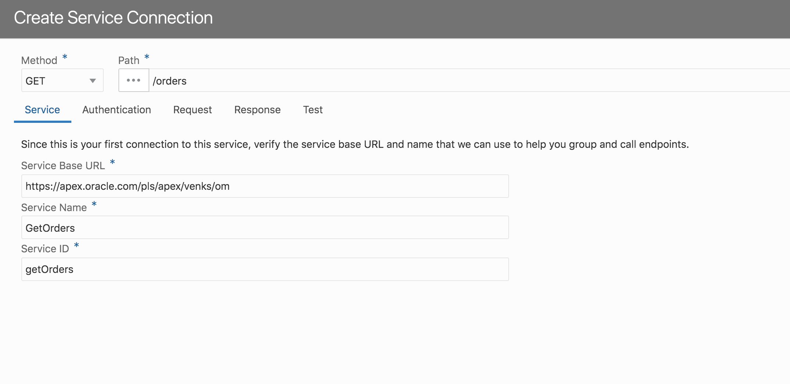

## Step 6: Click on Test → Send and then Copy Response to Body → Create 

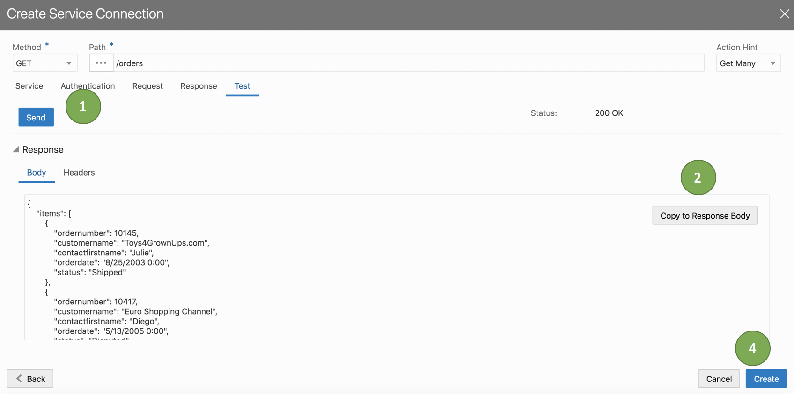

## Step 7: Navigate back to the orders page and drag & drop a table from the component palette as shown below

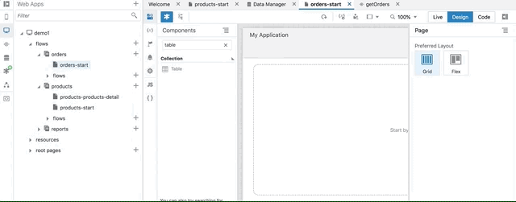

## Step 8: Now it is time to connect the table data to the service connection that we just defined. Refer to the flow below.
 


## Step 9: Run your application. 

The orders page should now display a list of orders, which it is pulling from a remote service.

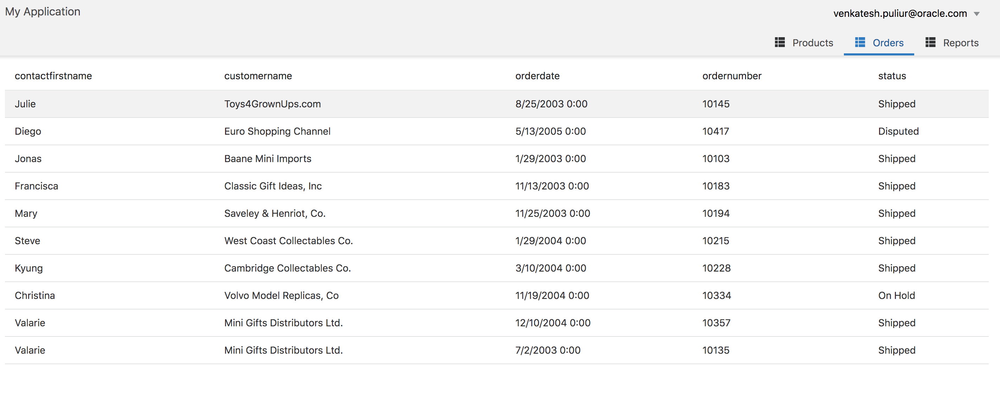

# Create a detail page from a third party rest endpoint.

Similar to lab 1 where we had created a detail page, we will be creating a order detail page which is pulling the data from a third party rest end point. Before we begin, we will have to define two service connections

1. Service Connection to retrieve Order Header Data : [https://apex.oracle.com/pls/apex/venks/om/order](https://apex.oracle.com/pls/apex/venks/om/orders/10145)/{order_number}
2. Service Connection to retrieve Order Lines Data : [https://apex.oracle.com/pls/apex/venks/om/orders/](https://apex.oracle.com/pls/apex/venks/om/orders/10145){order_number}

## Step 1 : Create a new service connection from rest endpoint using the following url
```
https://apex.oracle.com/pls/apex/venks/om/order/{order_number} 
```

The order_number is a parameter that we are going to pass to the endpoint.


## Step 2: Name the service connection getOrderHeader

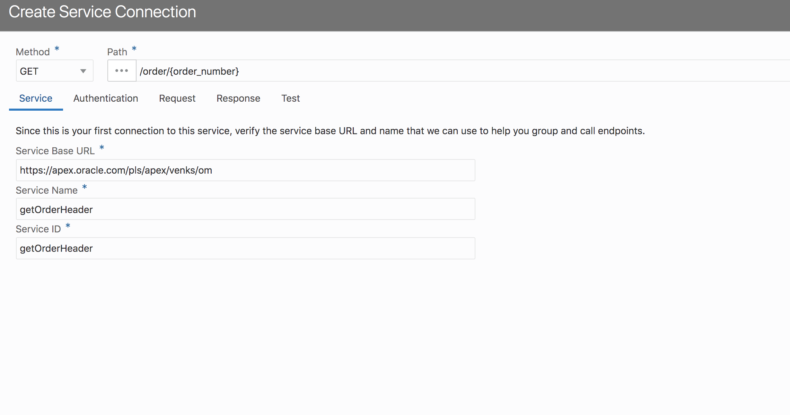

## Step 3: Click on Test → Provide a value for the order_number parameter → Click Send → Click Copy Response Body → Click Create

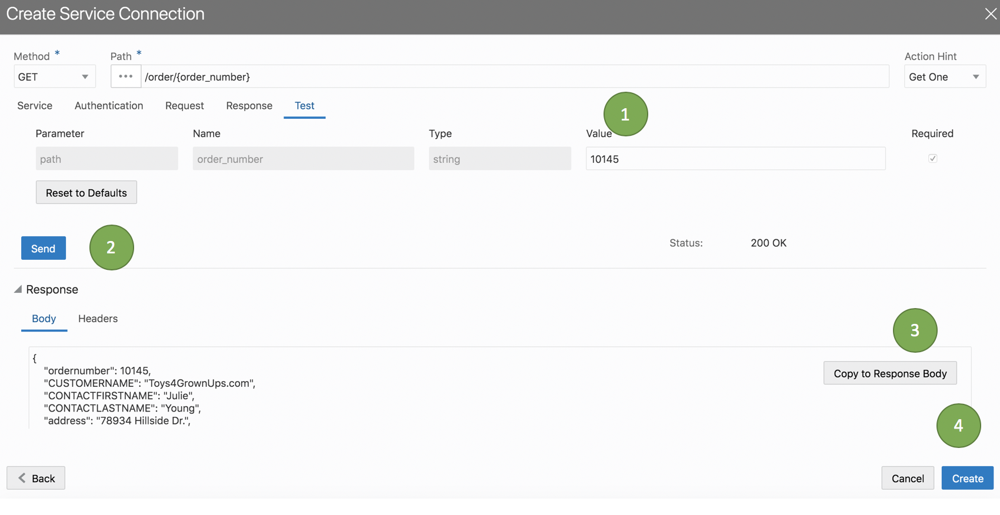

## Step 4: Navigate back to the order page and click on table in the page structure 

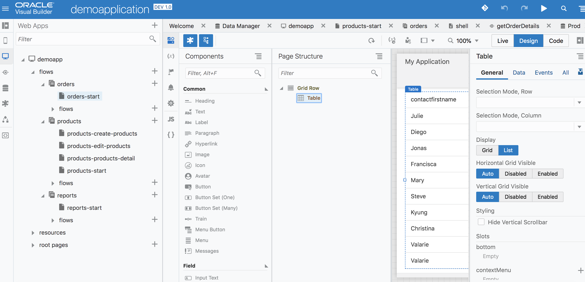

## Step 5: Click on add detail page as shown below

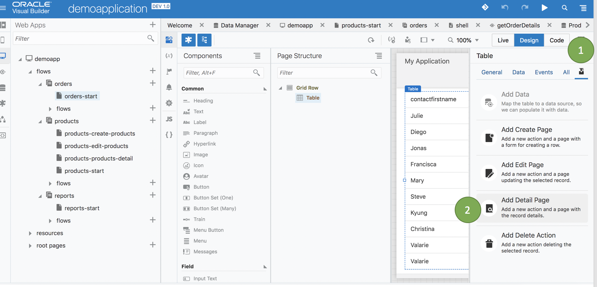

## Step 6: Choose the service connection we just created from the list → Create/Nextg

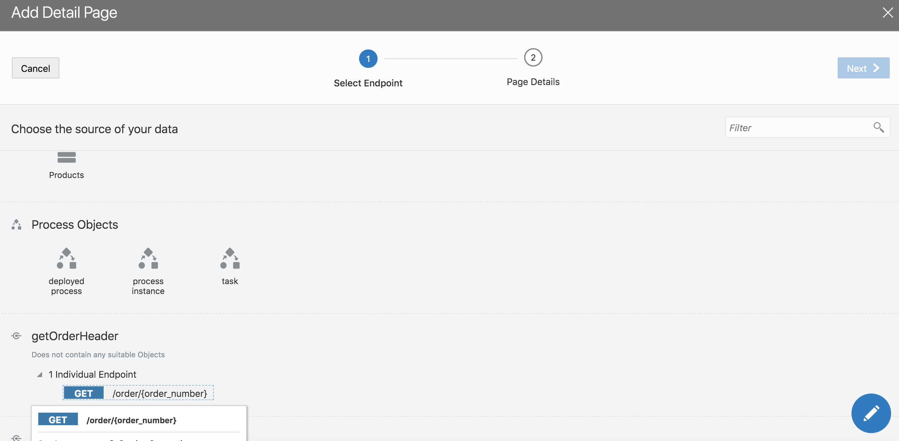

## Step 7: Choose all the fields from endpoint → Change Button Label to "Order Details" → Page title to "Order Details" → Page Name to "order-details" → Click Finish


Visual Builder will now create a new page called order details. In addition a new button will be added on top of the orders page. Select an order and click on order details.

You should be navigated to the order details page. The order header information should be displayed based on the order you selected in the previous page. 

# Add order lines from service connection to order details page

The next action item is to have order line details to the order details page. First we will define a service endpoint that connects to order lines rest endpoint.

## Step 1 : Add a new service connection. Ensure that the action hint is set to many. Use the following url
```
https://apex.oracle.com/pls/apex/venks/om/orders/{order_number}
```

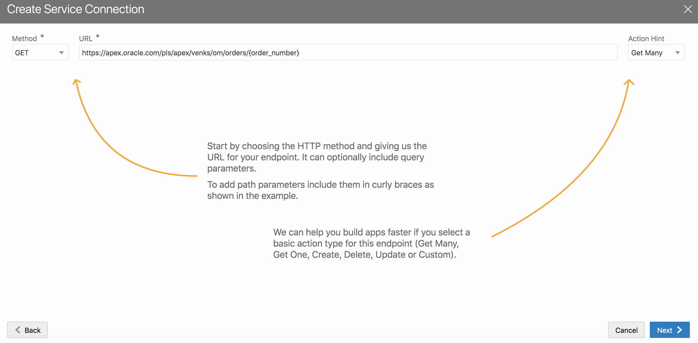

## Step 2 : Name the service endpoint getOrderLines

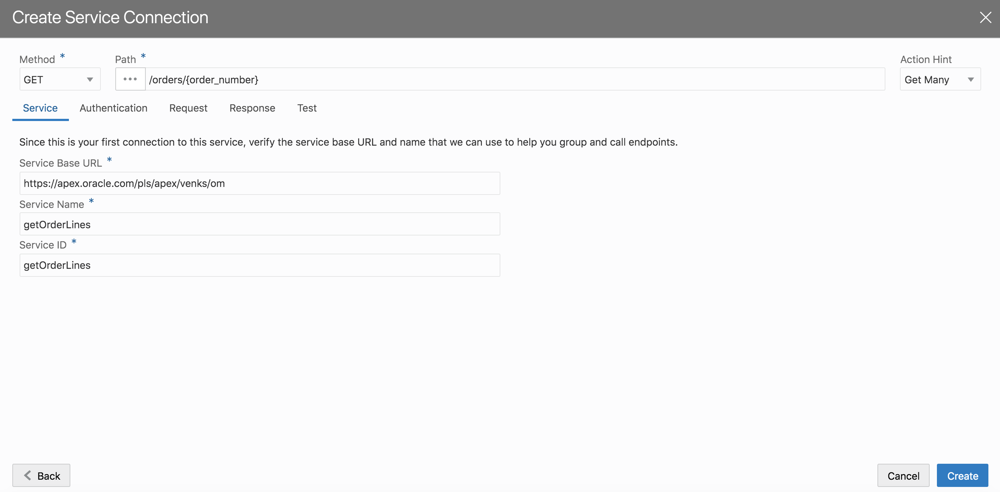

## Step 3 : Follow the sequence indicated below 

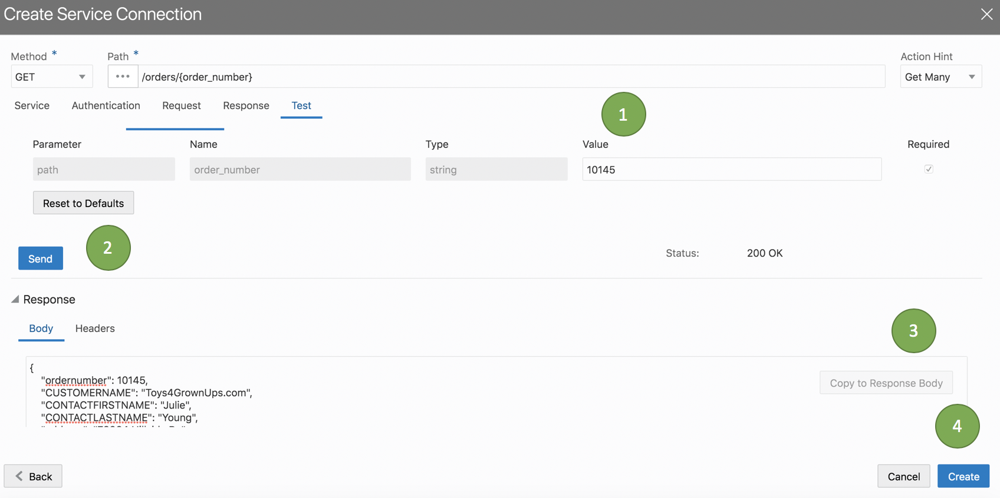

## Step 4: Navigate to the order details page and drag / drop a table component on the page as shown below.


## Step 4: Select on the newly added table in page structure and then click add data as shown below


## Step 4: Map the data to the newly created order lines service endpoint. Click Next

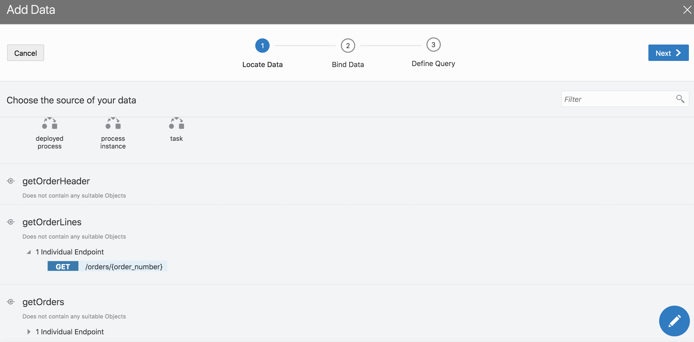

## Step 5: Choose the fields to display and set the primary key. Click Next

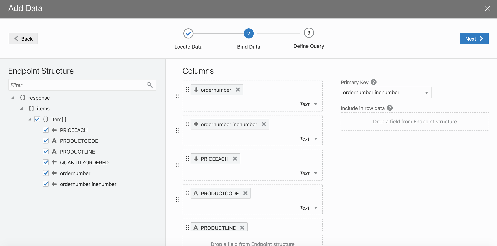

## Step 6 : Map the order number variable with the parameter to the service connection as show below. Click finish.

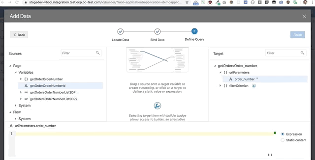

## Step 7 : Click run and navigate to orders page. Choose an order and click on order details. 

You should now be able to see the order lines below the order header section.

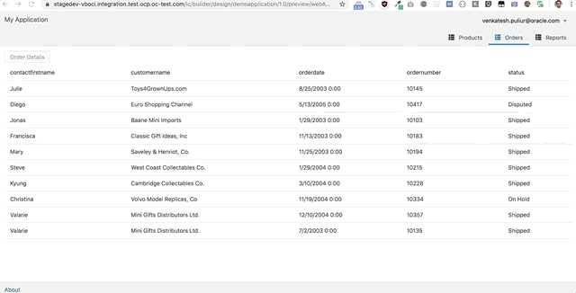

Congratulations, you have completed lab 3 [Click here to goto Lab 3](lab3)
