**# Introduction**

In this lab we will be creating a mobile application which replicates the functionality that we created for webapp. This mobile application can be distributed as PWA or native iOS or Android Application.

**# Mobile Application Setup**

**##### Step 1: Click on new mobile application**

**##### Step 2 : Choose vertical layout and key in the following navigation items**

**##### Step 3: Choose page template list**

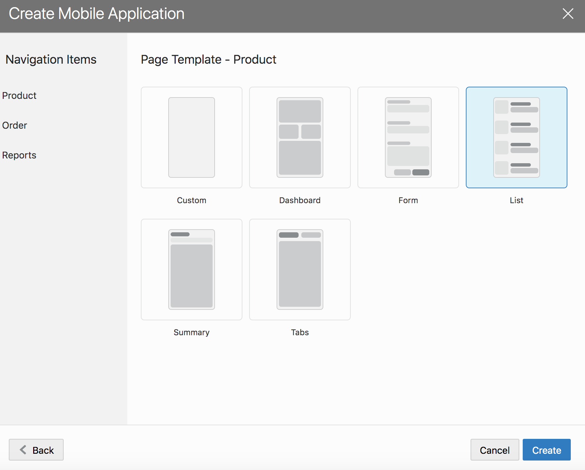

**# Products page** 

**##### Step 1 : Map the list view on the products page to the products business object**

**##### Step 2: Remove the URL field and replace it with an image**

[[ $current.data.url ]]

Delete the URL text item from the page structure

**##### Step 3: Set the image width attribute to 100**

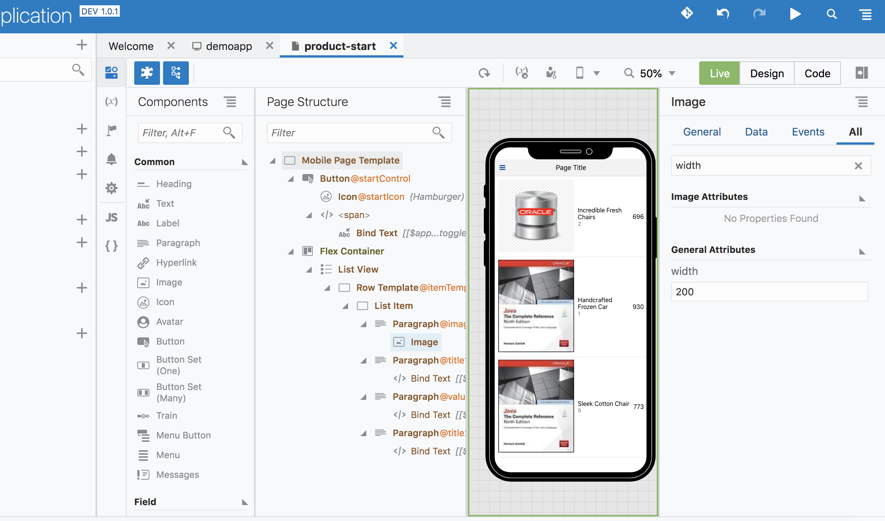

**##### Step 4: Drag & Drop rating gauge as shown in the screenshot below. Set the data value to [[ $current.data.rating ]]**

Delete the text field rendering of rating.

**##### Step 5: Run the application and you should see the following in the emulator view**

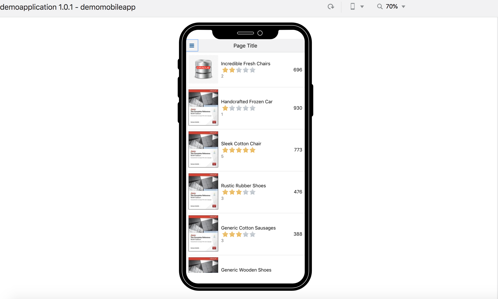

**# Product Edit Page**

We will now add an edit page, which is reveled in the mobile app with a swipe gesture on the product listing.

**##### Step 1 : Click add edit from the quick start menu option**

**##### **

**##### Step 2: Choose products BO in the quick start wizard**

**##### Step 3: Choose the fields you want to open up for edit in the products edit page**

**##### Step 4: In the simulator view swipe to reveal the edit page. Clicking save should save the data and you should see a confirmation message.**

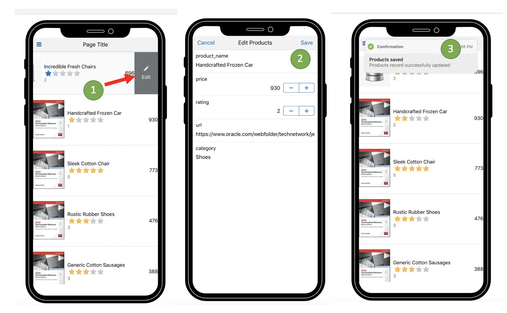

**# Order List Page**

Next we will wire up the order list page to display a list of orders.

**##### Step 1: Drag and drop list view into the orders page**

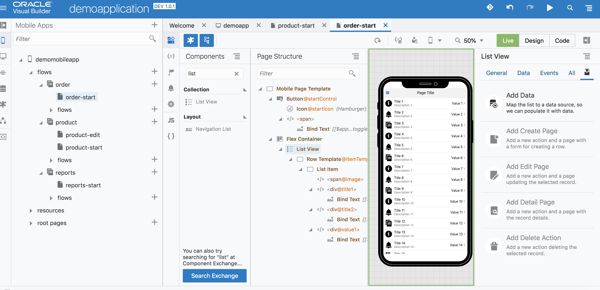

**##### Step 2: Click on add data from quick start to connect it to service end point defined earlier**

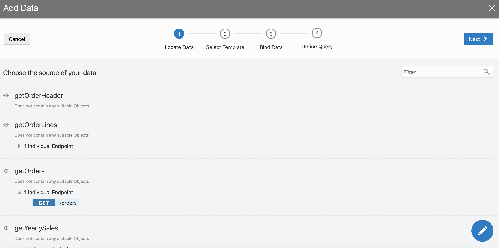

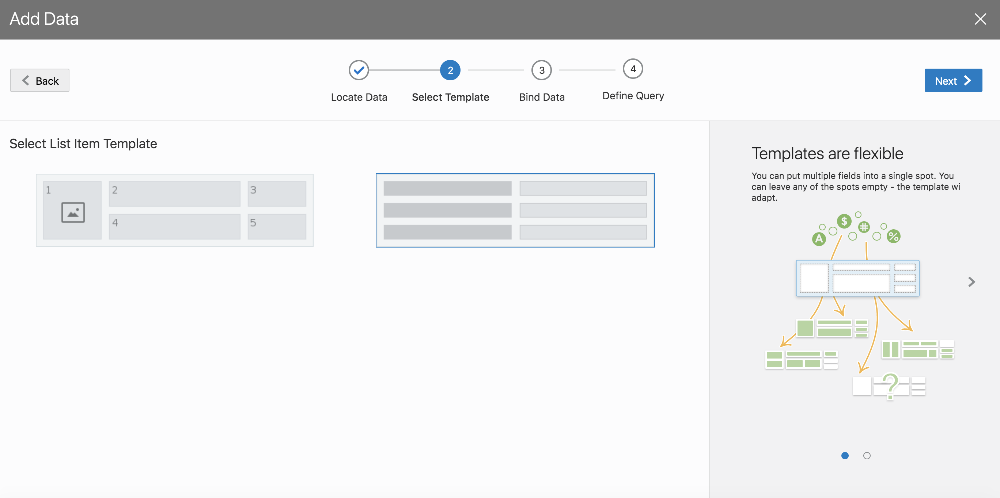

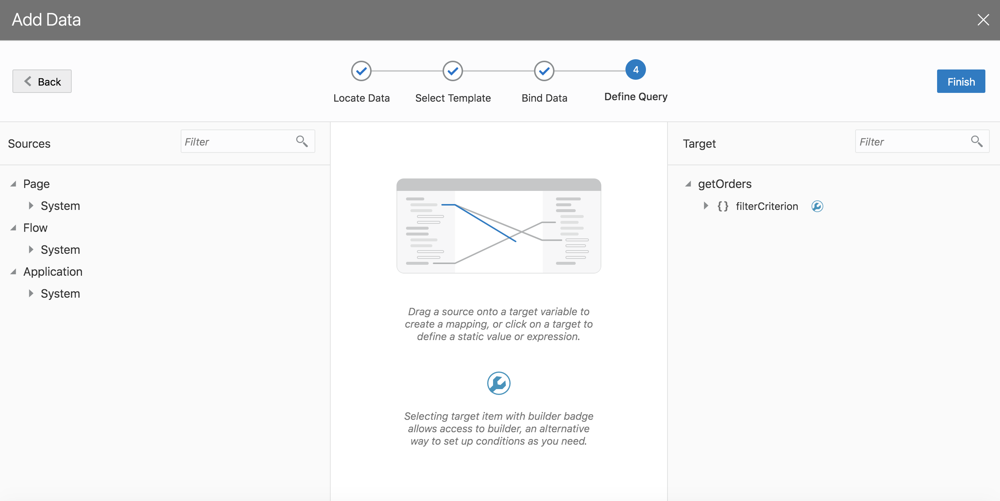

**##### Step 3: Add detail page**

Click on add detail page from the quick start. 

Note that there are going to be two sections to the order detail page. The header and lines section. We are first wiring up the order header section. The endpoint that we are connecting to for this is getOrderHeader.

**##### Step 4: Choose the all the fields you are going to display on the page. Rename the button, page title and page name to the following**

\- Button Label - Order Details

\- Page Title - Order Details

\- Page Name - order-details

Click finish

**##### Step 5: Now run the application and review that swiping on the order list takes you order detail page as shown in the animation below**

**##### Step 6: Drag and drop a table shown below in the order-details page that was created by quick start step 5**

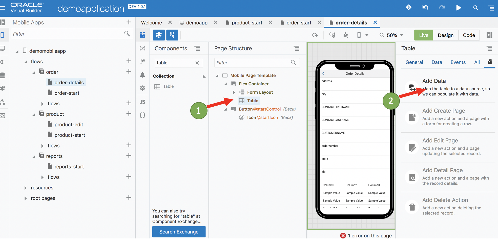

**##### Step 7: Click on add data and connect it to getOrderLines end point**

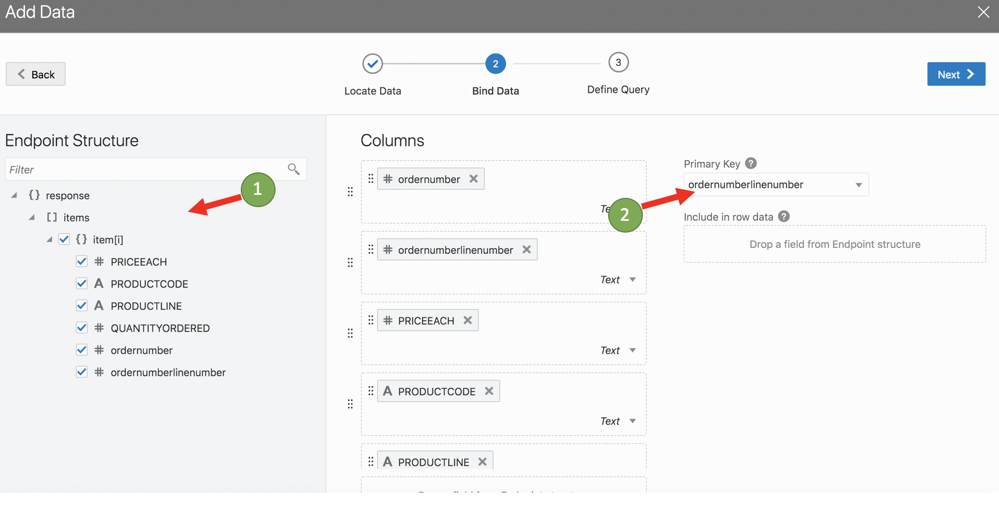

**##### Step 8: Since the end point expects order line number as a parameter, map the variable automatically created URL parameter by dragging it as shown below.**

**##### Step 8: Change the table headers fields to short labels as shown below**

**##### Step 9: Now navigate to the order details screen and you should see order header & lines**

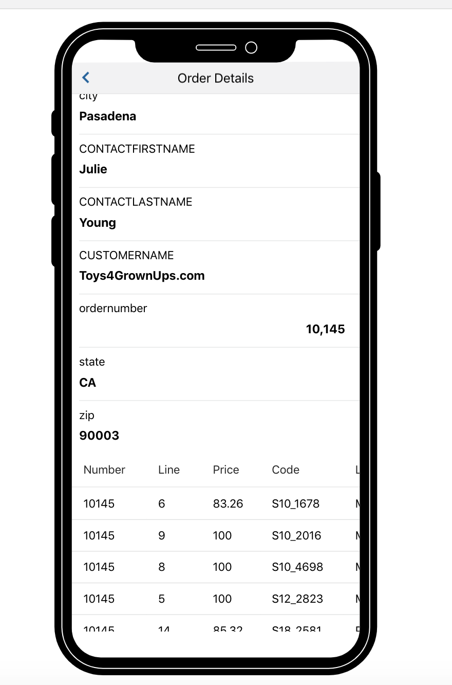

**# Reports page**

**##### Step 1: Drag and drop a bar chart to the reports page**

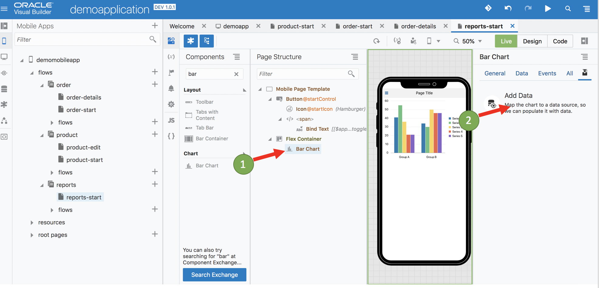

**##### Step 2: Click on add data and choose getYearlySales endpoint defined in the previous sections**

**##### Step 3: Choose Total for y-axis, Year for x-axis and Category for color series. Ensure id defaults to primary key**

**##### Step 4: View the chart rendering in the simulator view**

**##### Step 5: Drag and drop a pie chart under the bar chart we added earlier**

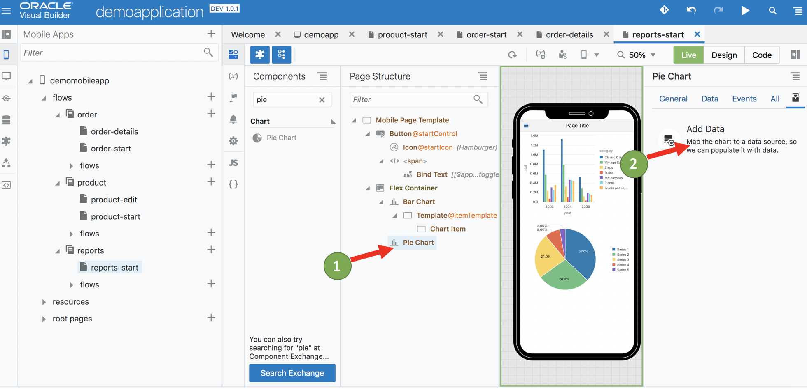

**##### Step 6: Connect it to getYearlySales endpoint by clicking on Add Data**

**##### Step 7: Choose total and color from the fields to be included in the pie chart**

**##### Step 8: Refresh the simulator and navigate to the reports page. Your screen should look like this**

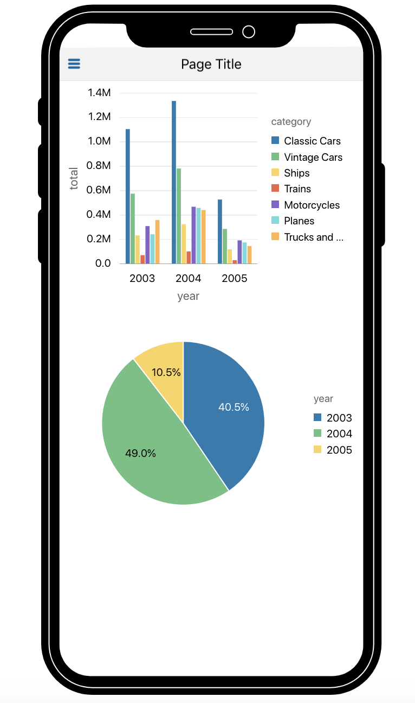

**# Publishing a PWA**

We will now publish a Progress Web Application. The configuration will generate a QR Code which you can use to scan and download the app to your phone.

**##### Step 1: First click on the Mobile App → Settings → Security → Allow Anonymous access**

For the sake of this demo, we want to enable anonymous access to the application. Follow the sequence of steps as shown below.

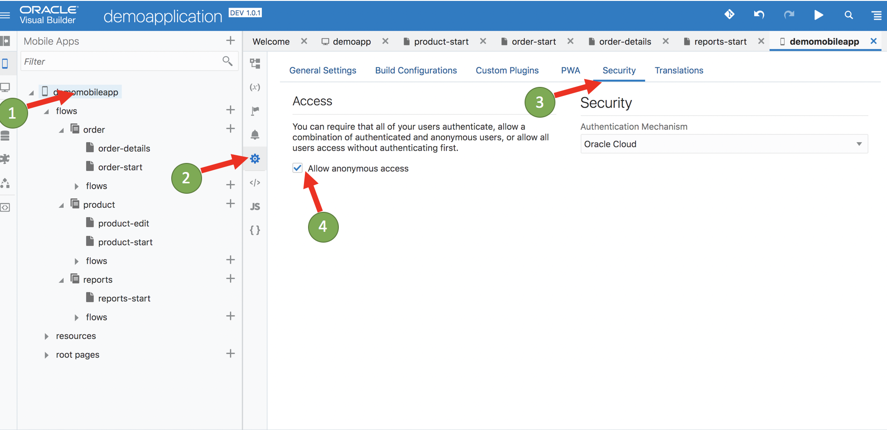

**##### Step 2: Click on PWA and enable PWA**

**##### Step 3: Allow anonymous access on the products business object**

This is for the sake of the demo, allow us to access the full functionality of the application anonymously.

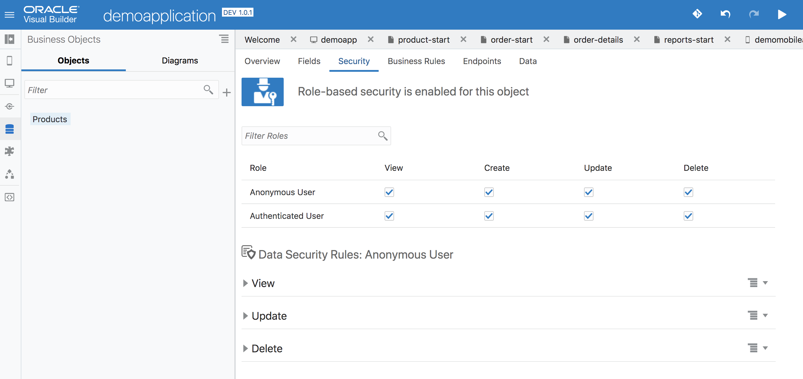

**##### Step 4: Click on run and navigate to the simulator window. Click on "build my app".**

Choose the option to move development data into production. Once completed you should be presented with a QR Code which you can use to download the app to your phone.

Congratulations ! You have completed all your lab exercises.