* TOC
{:toc}

# Introduction

Listed below are the steps to get started with Visual Builder in Oracle cloud. There two steps to this process

1. The first step is signing up for Oracle Cloud
2. The second step is provisioning a Visual Builder instance

# Signup for Oracle Cloud Trial

### Step 1 : Navigate to [https://cloud.oracle.com](https://cloud.oracle.com)

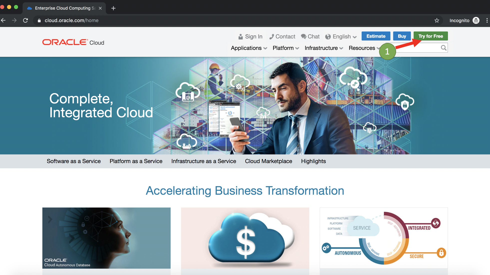

### Step 2: Important : Use the email address you used to register for Oracle OpenWorld/CodeOne

**Note: If you don't use this email address, you will have to provide credit card information.**

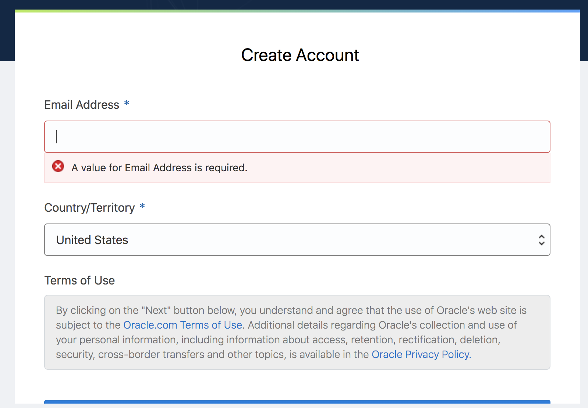

### Step 3: Choose the free trial program in the next screen

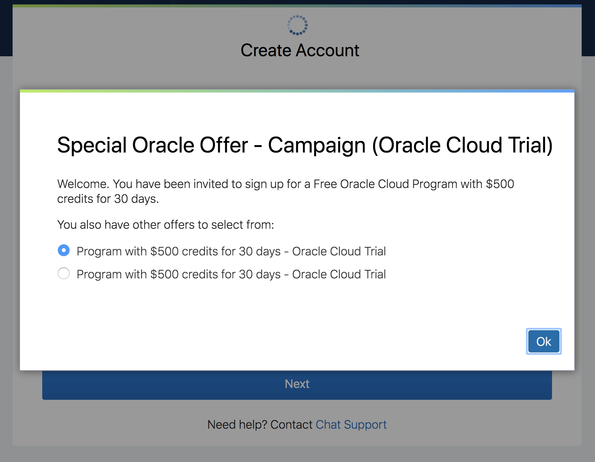

### Step 4: Choose a cloud account name

**Important: Please note this cloud account name. You will need this to log into the console**

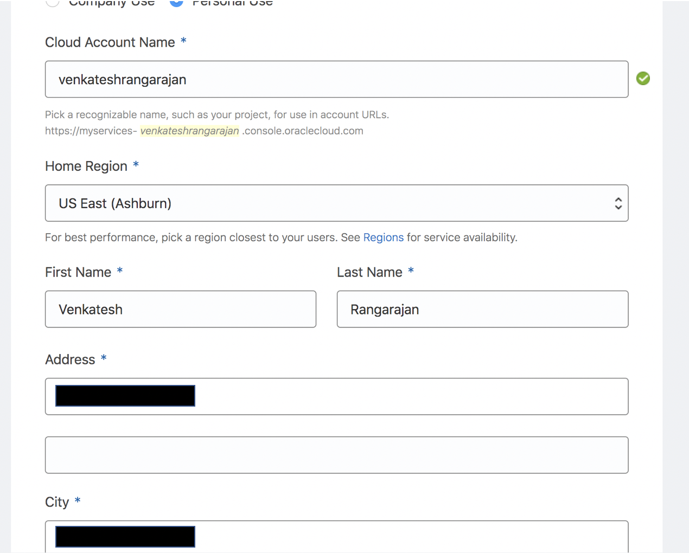

### Step 5: Accept the terms and conditions

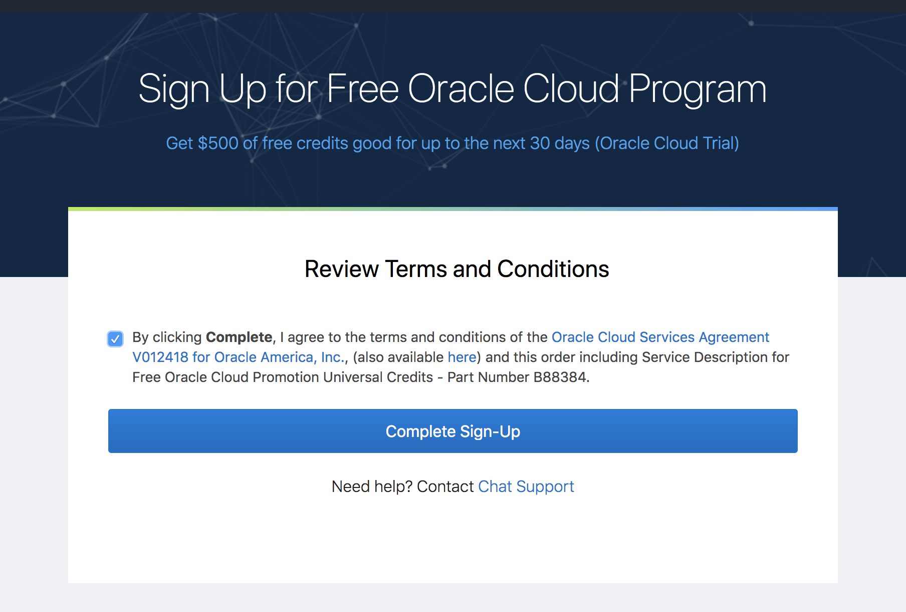

### Step 6: You should be redirected to the cloud console.

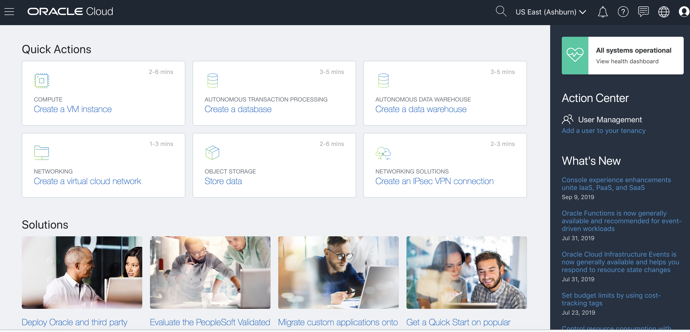

### Step 7: Log out of the console

# Provisioning Visual Builder Services

### Step 1: Navigate to : [https://cloud.oracle.com](https://cloud.oracle.com/) and click sign in

You should be presented with the following screen. Input the cloud account name that you created your cloud account under and click next.

### Step 2: Click on hamburger icon on the top left hand side of the screen and then hover over platform services to locate Visual Builder as shown below.

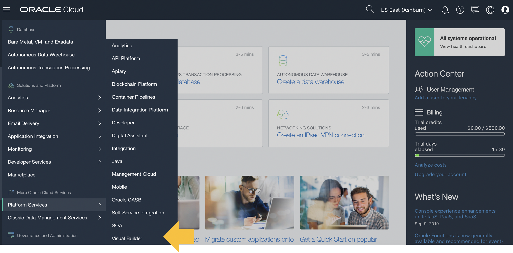

### Step 3: Click on Create Instance

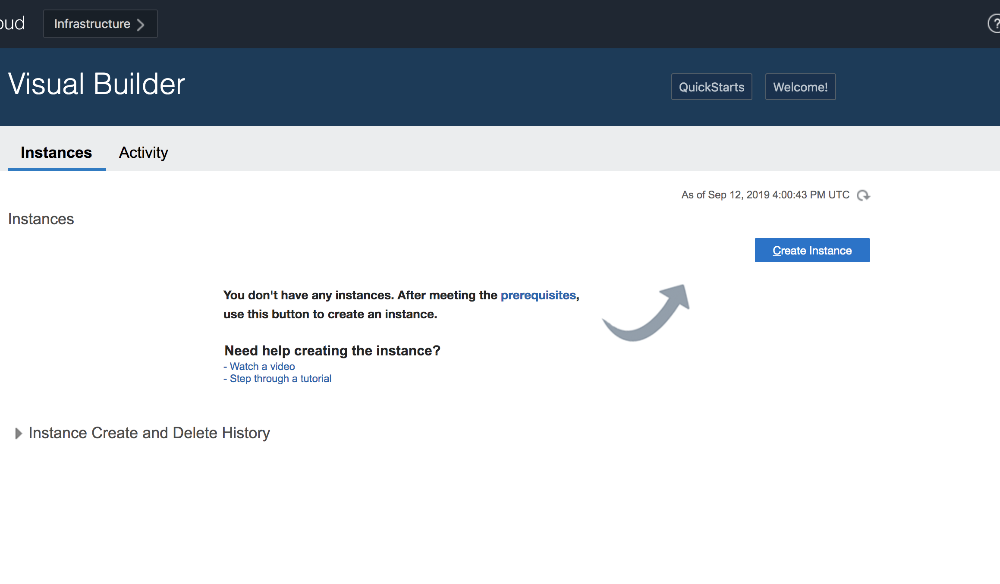

### Step 4: Provide a instance name. 

Important: To ensure prompt instance creation, leave the region to default "No Preference"

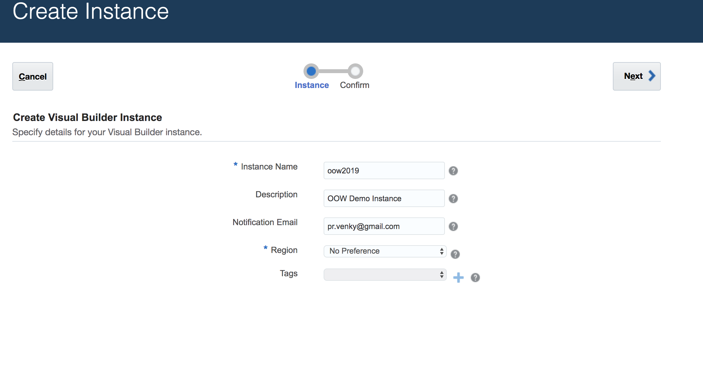

### Step 5: Go through the steps

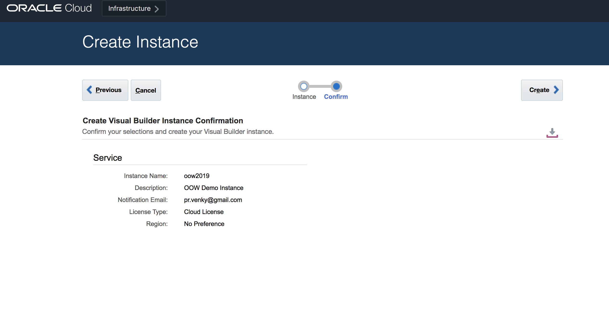

### Step 6: You should see the status "Creating services...."

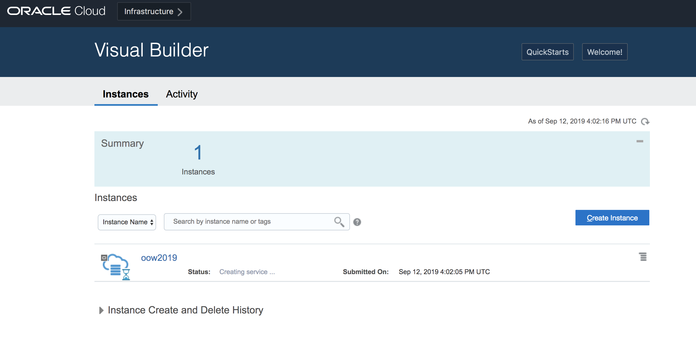

### Step 7: You should receive an email confirming provisioning of the instance. 

Once you receive the email, click on the hamburger icon next to the instance to navigate to Visual Builder

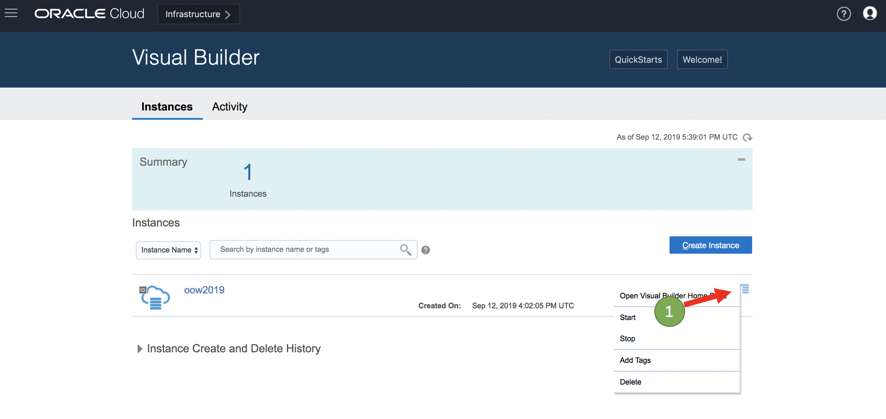

### Step 8: You should end be navigated to the following page

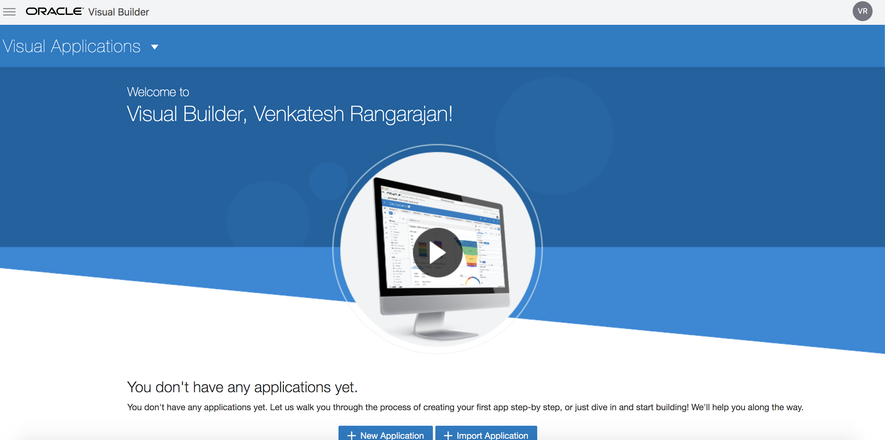

Congraguations : Your visual builder instance is setup and ready for use.